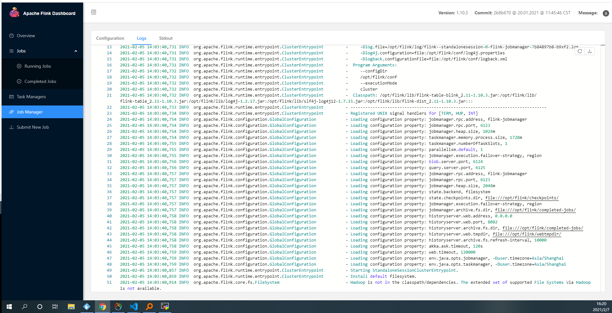

# flink: 容器化部署集群
在正式生产中，flink一般采用容器部署。下文将分别介绍docker-compose部署和基于k8s部署。
## 镜像制作
直接采用官网镜像部署是可以运行的，但是无法在web ui页面中看到jobmanager和tastmanager的运行日志，因此需要对官方镜像进行修改。本节下述内容主要参考了博客https://blog.csdn.net/allocator/article/details/106858679中的解决方案，具体操作如下：
- 拉取官方docker镜像：docker pull apache/flink:1.10-scala_2.11
- 创建启动脚本`docker-entrypoint.sh`并写入一下内容
```
#!/bin/sh
COMMAND_STANDALONE="standalone-job"

# If unspecified, the hostname of the container is taken as the JobManager address
JOB_MANAGER_RPC_ADDRESS=${JOB_MANAGER_RPC_ADDRESS:-$(hostname -f)}
CONF_FILE="${FLINK_HOME}/conf/flink-conf.yaml"

drop_privs_cmd() {
    if [ $(id -u) != 0 ]; then
        # Don't need to drop privs if EUID != 0
        return
    elif [ -x /sbin/su-exec ]; then
        # Alpine
        echo su-exec flink
    else
        # Others
        echo gosu flink
    fi
}

copy_plugins_if_required() {
  if [ -z "$ENABLE_BUILT_IN_PLUGINS" ]; then
    return 0
  fi

  echo "Enabling required built-in plugins"
  for target_plugin in $(echo "$ENABLE_BUILT_IN_PLUGINS" | tr ';' ' '); do
    echo "Linking ${target_plugin} to plugin directory"
    plugin_name=${target_plugin%.jar}

    mkdir -p "${FLINK_HOME}/plugins/${plugin_name}"
    if [ ! -e "${FLINK_HOME}/opt/${target_plugin}" ]; then
      echo "Plugin ${target_plugin} does not exist. Exiting."
      exit 1
    else
      ln -fs "${FLINK_HOME}/opt/${target_plugin}" "${FLINK_HOME}/plugins/${plugin_name}"
      echo "Successfully enabled ${target_plugin}"
    fi
  done
}

set_config_option() {
  local option=$1
  local value=$2

  # escape periods for usage in regular expressions
  local escaped_option=$(echo ${option} | sed -e "s/\./\\\./g")

  # either override an existing entry, or append a new one
  if grep -E "^${escaped_option}:.*" "${CONF_FILE}" > /dev/null; then
        sed -i -e "s/${escaped_option}:.*/$option: $value/g" "${CONF_FILE}"
  else
        echo "${option}: ${value}" >> "${CONF_FILE}"
  fi
}

set_common_options() {
    set_config_option jobmanager.rpc.address ${JOB_MANAGER_RPC_ADDRESS}
    set_config_option blob.server.port 6124
    set_config_option query.server.port 6125
}

prepare_job_manager_start() {
    echo "Starting Job Manager"
    copy_plugins_if_required

    set_common_options

    if [ -n "${FLINK_PROPERTIES}" ]; then
        echo "${FLINK_PROPERTIES}" >> "${CONF_FILE}"
    fi
    envsubst < "${CONF_FILE}" > "${CONF_FILE}.tmp" && mv "${CONF_FILE}.tmp" "${CONF_FILE}"
}

if [ "$1" = "help" ]; then
    echo "Usage: $(basename "$0") (jobmanager|${COMMAND_STANDALONE}|taskmanager|help)"
    exit 0
elif [ "$1" = "jobmanager" ]; then
    shift 1
    prepare_job_manager_start

    $FLINK_HOME/bin/jobmanager.sh start "$@"
elif [ "$1" = ${COMMAND_STANDALONE} ]; then
    shift 1
    prepare_job_manager_start

    $FLINK_HOME/bin/standalone-job.sh start "$@"
elif [ "$1" = "taskmanager" ]; then
    shift 1
    echo "Starting Task Manager"
    copy_plugins_if_required

    TASK_MANAGER_NUMBER_OF_TASK_SLOTS=${TASK_MANAGER_NUMBER_OF_TASK_SLOTS:-$(grep -c ^processor /proc/cpuinfo)}

    set_common_options
    set_config_option taskmanager.numberOfTaskSlots ${TASK_MANAGER_NUMBER_OF_TASK_SLOTS}

    if [ -n "${FLINK_PROPERTIES}" ]; then
        echo "${FLINK_PROPERTIES}" >> "${CONF_FILE}"
    fi
    envsubst < "${CONF_FILE}" > "${CONF_FILE}.tmp" && mv "${CONF_FILE}.tmp" "${CONF_FILE}"

    $FLINK_HOME/bin/taskmanager.sh start "$@"
fi

sleep 1
exec /bin/bash -c "tail -f $FLINK_HOME/log/*.log"
```
- 创建`Dockerfile`文件写入一下内容:
```
# FROM denvazh/scala:2.11.8-openjdk8
FROM apache/flink:1.10-scala_2.11
ADD ./docker-entrypoint.sh /
# Additional output to console, allows gettings logs with 'docker-compose logs'
WORKDIR $FLINK_HOME

# RUN chmod +x ${FLINK_HOME}/bin/docker-entrypoint.sh
ENTRYPOINT ["/docker-entrypoint.sh"]
```
- 执行命令`docker build -t myflink:1.10-scala_2.11 .`创建自己的镜像，该命令主要是将官方镜像的启动脚本替换为自己的启动脚本。

## 基于docker-compose部署
- docker-compose.yml文件：
```
version: '2'
services:
  jobmanager:
    image: 197.16.12.23/library/flink@sha256:5c4ac7404526542e8bff10a1e28b784374ce93ee7b356de37e0266aa5c24e51d
    environment:
      FLINK_PROPERTIES: |2
        jobmanager.rpc.address: jobmanager
        jobmanager.rpc.port: 6123
        jobmanager.heap.size: 2048m
        state.backend: filesystem
        state.checkpoints.dir: file:///opt/flink/checkpoints/
        jobmanager.execution.failover-strategy: region
        jobmanager.archive.fs.dir: file:///opt/flink/completed-jobs/
        historyserver.web.address: 0.0.0.0
        historyserver.web.port: 8082
        historyserver.archive.fs.dir: file:///opt/flink/completed-jobs/
        historyserver.web.tmpdir: file:///opt/flink/webtmpdir/
        historyserver.archive.fs.refresh-interval: 10000
        akka.ask.timeout: 120s
        web.timeout: 120000
    ports:
    - 8081:8081/tcp
    command:
    - jobmanager
  taskmanager:
    image: 197.16.12.23/library/flink@sha256:5c4ac7404526542e8bff10a1e28b784374ce93ee7b356de37e0266aa5c24e51d
    environment:
      FLINK_PROPERTIES: |2-

        jobmanager.rpc.address: jobmanager
        taskmanager.numberOfTaskSlots: 2
        taskmanager.memory.process.size: 2048m
        taskmanager.numberOfTaskSlots: 2
        state.backend: filesystem
        state.checkpoints.dir: file:///opt/flink/checkpoints/
        restart-strategy: failure-rate
        restart-strategy.failure-rate.max-failures-per-interval: 10
        restart-strategy.failure-rate.failure-rate-interval: 300s
        restart-strategy.failure-rate.delay: 15s
        historyserver.web.address: 0.0.0.0
        historyserver.web.port: 8082
        historyserver.archive.fs.dir: file:///opt/flink/completed-jobs/
        historyserver.web.tmpdir: file:///opt/flink/webtmpdir/
        historyserver.archive.fs.refresh-interval: 10000
        akka.ask.timeout: 120s
        web.timeout: 120000
    command:
    - taskmanager
```
- rancher-compose.yml文件：

```
version: '2'
services:
  jobmanager:
    scale: 1
    start_on_create: true
  taskmanager:
    scale: 2
    start_on_create: true

```

其中docker-compose.yml文件中的image标签值对应为rancher可以够得着的镜像地址，原始flink-conf.yaml中的配置参数对应为 environment:FLINK_PROPERTIES中的取值。因为测试环境中没有hdfs，checkpoint和savepoint的地址都指向本地文件系统。

通过rancher-compose.yml中scale标签可以设置对影jobmanager和taskmanager的个数。

## 基于k8s部署
k8s上的部署过程还是采用上述镜像，该部署方案参考了博客https://blog.csdn.net/rivendong/article/details/102620898，https://blog.csdn.net/qq_20466211/article/details/107340829，为达到和基于docker-compose的部署一样效果，对原始博客中的配置做了一定的修改，具体如下：
- jobmanager-depolyment.yaml文件
```
apiVersion: apps/v1
kind: Deployment
metadata:
  name: flink-jobmanager
  labels:
    app: flink-jobmanager
spec:
  replicas: 1
  selector:
    matchLabels:
      app: flink-jobmanager
  template:
    metadata:
      labels:
        app: flink-jobmanager
    spec:
      containers:
        - name: flink-jobmanager
          image: 197.16.12.23/library/flink@sha256:5c4ac7404526542e8bff10a1e28b784374ce93ee7b356de37e0266aa5c24e51d
          imagePullPolicy: Always
          ports:
            - containerPort: 6123
            - containerPort: 8081
          args: ["jobmanager"]
          env:
            - name: JOB_MANAGER_RPC_ADDRESS
              value: flink-jobmanager
            - name: FLINK_PROPERTIES
              value: 'jobmanager.rpc.address: flink-jobmanager\n
                jobmanager.rpc.port: 6123\n
                jobmanager.heap.size: 1024m\n
                state.backend: filesystem\n
                state.checkpoints.dir: file:///opt/flink/checkpoints/\n
                jobmanager.execution.failover-strategy: region\n
                jobmanager.archive.fs.dir: file:///opt/flink/completed-jobs/\n
                historyserver.web.address: 0.0.0.0\n
                historyserver.web.port: 8082\n
                historyserver.archive.fs.dir: file:///opt/flink/completed-jobs/\n
                historyserver.web.tmpdir: file:///opt/flink/webtmpdir/\n
                historyserver.archive.fs.refresh-interval: 10000\n
                akka.ask.timeout: 120s\n
                web.timeout: 120000\n
                env.java.opts.jobmanager: -Duser.timezone=Asia/Shanghai\n
                env.java.opts.taskmanager: -Duser.timezone=Asia/Shanghai'
      imagePullSecrets:
        - name: dockersecret
---
# 暴露service 方便taskmanager 连接
apiVersion: v1
kind: Service
metadata:
  name: flink-jobmanager
  labels:
    app: flink-jobmanager
spec:
  type: NodePort
  ports:
    - port: 8081
      targetPort: 8081
      nodePort: 30423
      protocol: TCP
      name: http
    - port: 6123
      targetPort: 6123
      protocol: TCP
      name: rpc
    - port: 6124
      targetPort: 6124
      protocol: TCP
      name: blob
    - port: 6125
      targetPort: 6125
      protocol: TCP
      name: query
    - port: 6126
      targetPort: 6126
      protocol: TCP
      name: ui

  selector:
    app: flink-jobmanager
---
```
- taskmanager-depolyment.yaml文件：
```
apiVersion: apps/v1
kind: Deployment
metadata:
  name: flink-taskmanager
  labels:
    app: flink-taskmanager
spec:
  replicas: 3
  selector:
    matchLabels:
      app: flink-taskmanager
  template:
    metadata:
      labels:
        app: flink-taskmanager
    spec:
      containers:
        - name: flink-taskmanager
          image: 197.16.12.23/library/flink@sha256:5c4ac7404526542e8bff10a1e28b784374ce93ee7b356de37e0266aa5c24e51d
          imagePullPolicy: Always
          ports:
            - containerPort: 6121
              name: data
            - containerPort: 6122
              name: rpc
            - containerPort: 6125
              name: query
          args: ["taskmanager"]
          env:
            - name: JOB_MANAGER_RPC_ADDRESS
              value: flink-jobmanager
            - name: FLINK_PROPERTIES
              value: 'jobmanager.rpc.address: flink-jobmanager\n
                taskmanager.numberOfTaskSlots: 2\n
                taskmanager.memory.process.size: 1024m\n
                taskmanager.numberOfTaskSlots: 2\n
                state.backend: filesystem\n
                state.checkpoints.dir: file:///opt/flink/checkpoints/\n
                restart-strategy: failure-rate\n
                restart-strategy.failure-rate.max-failures-per-interval: 10\n
                restart-strategy.failure-rate.failure-rate-interval: 300s\n
                restart-strategy.failure-rate.delay: 15s\n
                historyserver.web.address: 0.0.0.0\n
                historyserver.web.port: 8082\n
                historyserver.archive.fs.dir: file:///opt/flink/completed-jobs/\n
                historyserver.web.tmpdir: file:///opt/flink/webtmpdir/\n
                historyserver.archive.fs.refresh-interval: 10000\n
                akka.ask.timeout: 120s\n
                web.timeout: 120000\n
                env.java.opts.jobmanager: -Duser.timezone=Asia/Shanghai\n
                env.java.opts.taskmanager: -Duser.timezone=Asia/Shanghai\n
                env.java.opts: -Dlog4j2.formatMsgNoLookups=true'
      imagePullSecrets:
        - name: dockersecret
```

## web ui页面
按照上述任一一种方案部署就可以在web ui页面中进行日志查看、任务提交、任务重启等操作。若需要修改checkpoint存储位置、时区、重启策略可在上述配置环境变量中修改，之后重新发布。
