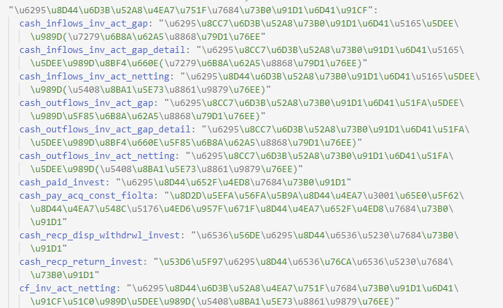
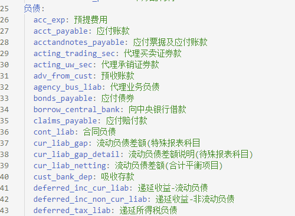

# python操作yaml文件
同xml格式文件相比，yaml文件的键值对结构上更加清晰、简介，很多项目中配置参数也已yaml格式文件保存。

## yaml相关包安装
python中操作yaml文件需要安装pyyaml包，可以在控制台或终端中使用pip命令安装。
```
pip install pyyaml
```
## 读取yaml文件转存为dict
```
import os
import yaml

with open(r'./data.yml', 'r', encoding='utf-8') as f:
    data = yaml.load(f, Loader=yaml.FullLoader)
```
`encoding`参数需要根据原始文件编码来定。python3中若不在载入yaml数据是提供`Loader=yaml.FullLoader`,会报安全警告。
```
YAMLLoadWarning: calling yaml.load() without Loader=... is deprecated, as the default Loader is unsafe. Please read https://msg.pyyaml.org/load for full details.
  data = yaml.load(f)
```
## dict保存到yaml
若dict没有中文字符，可以直接使用下述代码保存,`encoding`根据需要自行设定.
```
with open(r'./data.yml', 'w', encoding='utf-8') as f:
    yaml.dump(dict_data, f)
```
若dict中有中文，使用上述代码保存后，中文字符为unicode编码，添加参数`default_flow_style=False, encoding='utf-8',allow_unicode=True`后才能让中文正常显示。

```
with open(r'./data.yml', 'w', encoding='utf-8') as f:
    yaml.dump(keys_dict, f, default_flow_style=False, encoding='utf-8',allow_unicode=True)
```
