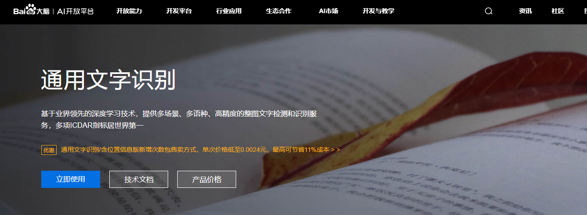
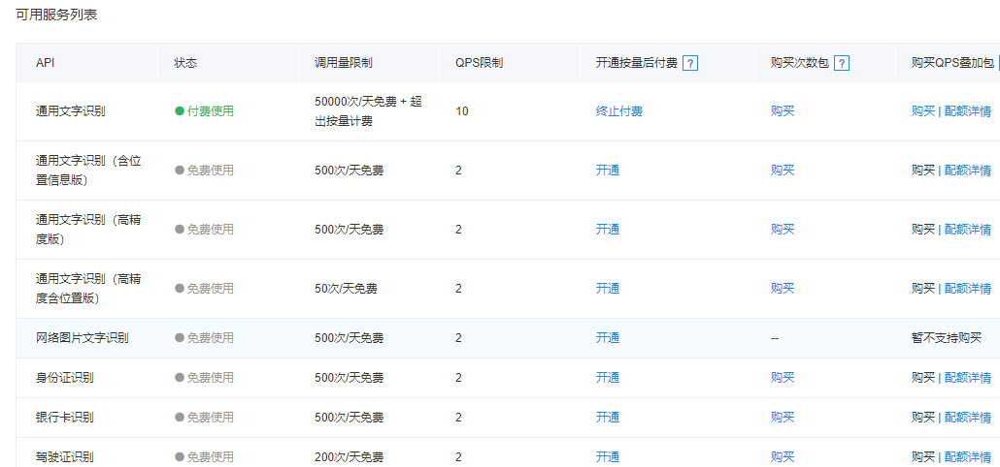
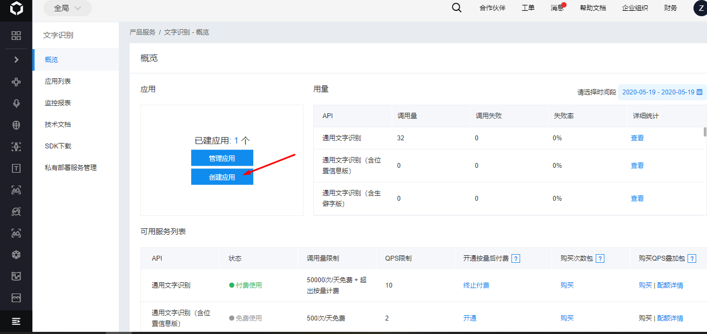
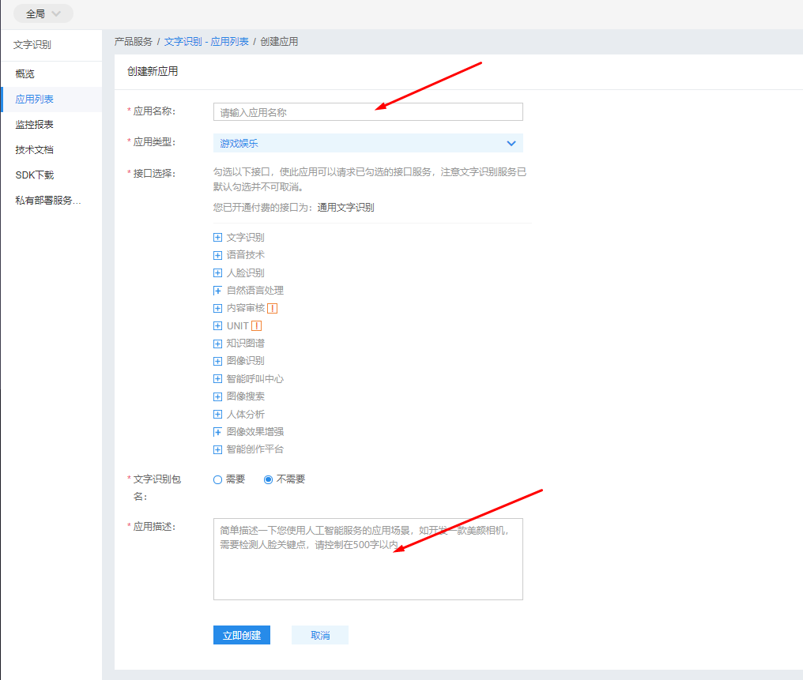
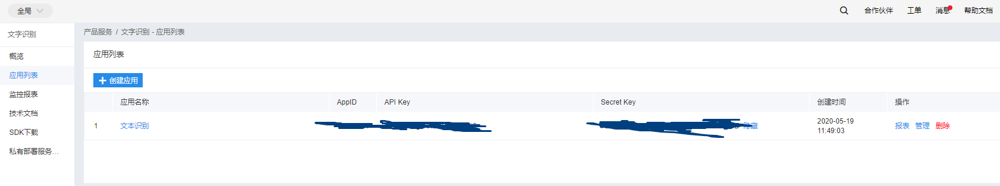
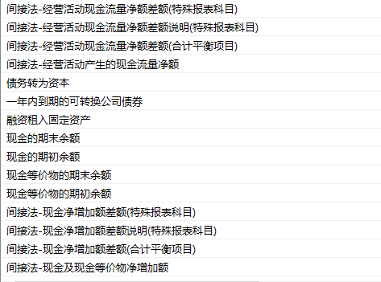

# 基于百度OCR提取图像中的文本
从图片或者扫描版的pdf文件中提取出文本信息的需求在日常工作和学习中经常遇到。扫描版的pdf文件可以使用adobe acrobat将文本数据提取出来，不过adobe acrobat安装文件较大且收费。部分网站也提供在线OCR服务，这些网站在不注册的情况下多数不支持批量转换且识别率较低，想要获取批量准换服务及提高识别率就需要注册且付费。本文主要讲述如何通过百度OCR服务来识别图片中的文本。

## 开通百度OCR服务
1. 登录百度的AI开放平台，在开放功能的文本识别模块选择通用文字识别，开通服务（下面图片是开通服务后的页面）。

百度提供的OCR服务比较多，一般的OCR需求选择“通用文字识别”即可，每日前50000次可免费使用。其它高级服务免费额度较少且收费较高，可根据实际需求开通。

2. 进入控制台，点击“创建应用”，在“创建应用页面”填写“应用名称”和“应用描述”后点击“立即创建”实例化一个通用文字识别应用。



应用中的APP_ID、API_KEY、SECRET_KEY三个字段在后续调用服务的时候需要用到。
## python SDK使用OCR服务
百度OCR服务提供了API接口，用户可以通过构建post请求使用OCR服务。SDK方面，支持java、python、php、c等主流语言，本节主要描述python的调用方法。
1. 安装python SDK
```
pip install baidu-aip
```
2. 识别本地图片
```
from aip import AipOcr
APP_ID = '******'
API_KEY = 'kE********GR*****Ii6'
SECRET_KEY = '****LTsY****a0V2***'
from aip import AipOcr
def get_file_content(filePath):
    with open(filePath, 'rb') as fp:
        return fp.read()

image = get_file_content('example.jpg')

client.basicGeneral(image);
for e in data['words_result']:
    print(e['words'])
```
若对识别语言和文本方向有特殊需求可在构建client的时候附加options参数选项。
````
from aip import AipOcr
APP_ID = '******'
API_KEY = 'kE********GR*****Ii6'
SECRET_KEY = '****LTsY****a0V2***'
from aip import AipOcr
def get_file_content(filePath):
    with open(filePath, 'rb') as fp:
        return fp.read()

image = get_file_content('example.jpg')

options = {}
options["language_type"] = "CHN_ENG"
options["detect_direction"] = "false"
options["detect_language"] = "false"
options["probability"] = "true"

data = client.basicGeneral(image, options)

for e in data['words_result']:
    print(e['words'])
````
3. 含有生僻字的文本识别
```
data = client.enhancedGeneral(image) # 常规调用
data = client.enhancedGeneral(image, options) # 带配置参数的调用
```
4. 网络图片文字识别
请求识别一些网络上背景复杂，特殊字体的文字。
```
data = client.webImage(image) # 常规调用
data = client.webImage(image, options) # 带配置参数的调用
```
url图片识别
```
data = client.webImageUrl(image) # 常规调用
data = client.webImageUrl(image, options) # 带配置参数的调用
```
## 完整代码及示例
```
from aip import AipOcr

APP_ID = '19947644'
API_KEY = 'kEKgIchHgGVIsuiFZ7oGRIi6'
SECRET_KEY = 'Pz24P4dGjLTsYdWaY3qv1Wa0V2HQ3MvB'


client = AipOcr(APP_ID, API_KEY, SECRET_KEY)
def get_file_content(filePath):
    with open(filePath, 'rb') as fp:
        return fp.read()

image = get_file_content(r'./Screenshot_31.png')

options = {}
options["language_type"] = "CHN_ENG"
options["detect_direction"] = "false"
options["detect_language"] = "false"
options["probability"] = "true"

data = client.basicGeneral(image, options)

for e in data['words_result']:
    print(e['words'])
```
- 原始图片

- 识别结果
```
间接法-经营活动现金流量净额差额(特殊报表科目)
间接法-经营活动现金流量净额差额说明特殊报表科目
间接法-经营活动现金流量净额差额(合计平衡项目)
间接法-经营活动产生的现金流量净额
债务转为資本
年内到期的可转换公司债券
屈资租入固定资产
现金的期末余额
现金的期初余额
现金等价物的期末余额
现金等价物的期初余额
间接法-现金净增加额差额特殊报表科目)
间接法-现金净增加额差额说明待殊报表科
间接法-现金净增加额差额(合计平衡项目)
间接法-现金及现金等价物净增加额
```