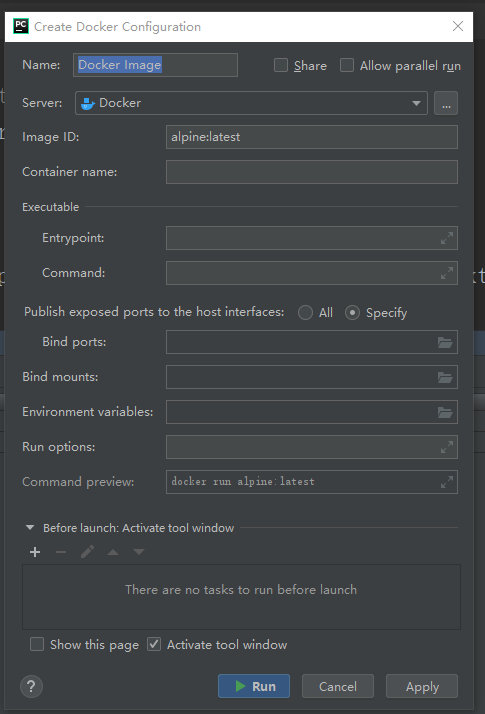

# flask程序docker镜像打包及容器发布
## docker服务端开启ca认证
具体操作方法可参见[https://www.cnblogs.com/yamiya/p/12578567.html](https://www.cnblogs.com/yamiya/p/12578567.html)，需要注意的事docker.service文件内ExecStart属性需改为以下内容：
```
ExecStart=/usr/bin/dockerd -H fd:// --containerd=/run/containerd/containerd.sock \
          --tlsverify --tlscacert=/etc/docker/ca.pem \
          --tlscert=/etc/docker/server-cert.pem \
          --tlskey=/etc/docker/server-key.pem \
          -H tcp://0.0.0.0:2375 -H unix:///var/run/docker.sock
```

将服务器上的认证信息下载到本地，放到指定位置。

## pycharm连接docker
在菜单打开Settings->Build->Docker,`Engine API URL`填入docker服务器的ip和端口，`Certificates folder`填写本地认证信息所在目录，点击确认完成配置。


在pycharm的页面中打开docker插件，连上服务器后即可看到已有镜像和已发布的容器。

## flask程序镜像打包
- 编写Dockfile文件，内容可参考如下内容：
```
FROM python:3.7-slim
MAINTAINER zhangsan

# We copy just the requirements.txt first to leverage Docker cache
COPY ./requirements.txt /app/requirements.txt

WORKDIR /app

RUN pip install -i https://pypi.douban.com/simple/ -r requirements.txt

ADD . /app
EXPOSE 5000
CMD python manage.py runserver --host 0.0.0.0
```
- 生成`requirements.txt`文件
  - pip3 install pipreqs
  - 根目录下：pipreqs ./ --encoding=utf8 --force
- 打开Dockfile的文件编辑，填写image tag.

- 打包：点击Dockerfile内的绿色双箭头，选择`Build Image for Dockfile`，待执行完成后即可在docker服务器中看到镜像。


## 容器发布
在Dock插件内选定此前生成的进行，右键单击选择`Create container`,在弹出的对话框中的`Container name`和`Bind ports`中分别写入容器名和端口映射关系，后点击`Run`即可发布容器。

在容器的`log`一栏中即可看到运行日志：

若想在其它机器上访问容器，记得在服务器的防火墙内放行端口。