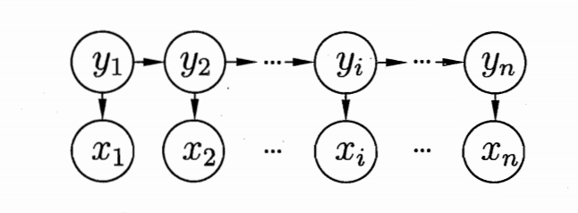
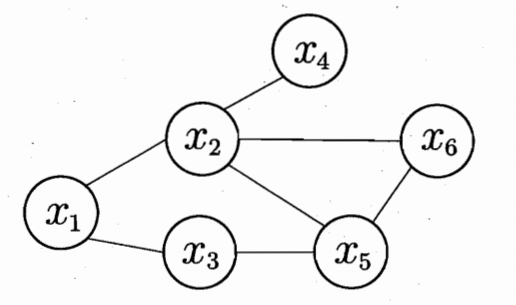

# 机器学习--概率图
---
## 预备知识
令状态变量集合为$Y$,可观测变量集合$O$,其它变量集合$R$,则有
- **生成式**：$P(Y,R,O)$
- **判别式**：$P(Y,R|O)$

给定一组观测变量值，推断就是要由$P(Y,R,O)$或$P(Y,R|O)$得到条件概率分布$P(Y|O)$.
## 概率图
概率图分为两种：
- 有向图（贝叶斯网）；
- 无向图（马尔科夫网）。

特殊的，HMM是结构最简单的动态贝叶斯网。
## 隐马尔科夫链(HMM)
令状态变量$y = \{y_1, y_2, \cdots, y_n\}^T$,观测变量$x = \{x_1, x_2, \cdots, x_n\}$。时刻$t_i$的状态变量(隐变量)$y_i \in \mathbb{Y} = \{s_1,s_2,\cdots, s_N\}$，观测变量$x_i \in \mathbb{X} = \{o_1,o_2,\cdots, o_M\}$。状态空间$\mathbb{Y}$为离散空间，$\mathbb{X}$可以是离散空间，也可以是连续空间。任意时刻$t$，$x_t$仅依赖于$y_t$，$y_t$仅依赖于$y_{t-1}$。满足这些要求的概率图称为**隐马尔可夫链**。

### 联合概率公式：

$P(x_1,y_1,\cdots,x_n, y_n)=P(y_1)P(x_1|y_1)\prod_{i=2}^n{P(y_i|y_{i-1})P(x_i|y_i)}$

### HMM三组重要参数：
- **状态转移矩阵**：$A$，其中$a_{ij}=P(y_{t+1}=s_{t+1}|y_t=s_i)$;
- **输出观测矩阵**：$B$，其中$b_{ij}=P(x_t=o_j|y_t=s_i)$;
- **初始状态概率**：$\pi = (\pi_1,\pi_2,\cdots,\pi_N)$,$\pi_i=P(y_1=s_i)$.

### HMM三个基本问题：
- 已知$\lambda = [A,B,\pi]$，计算$P(x|\lambda)$;
- 已知$\lambda = [A,B,\pi]$和$x$，计算$y$;
- 已知$x$，$\argmax_{\lambda}P(x|\lambda)$.
## 马尔科夫随机场(MRF)

### 基本概念：
- **团**：$P$为图的节点子集，任意$p_i,p_j \in P, i \neq j$之间存在边连接；
- **极大团**：$P$为图的节点子集，任意$p_i \in P^{\mathcal{C}}$加入$P$后新的子集不构成团。
### 联合概率公式
令$x = \{x_1, x_2,\cdots, x_n\}$,$C$为所有团构成的集合且$Q_i \cap Q_j = \varnothing $