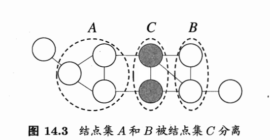
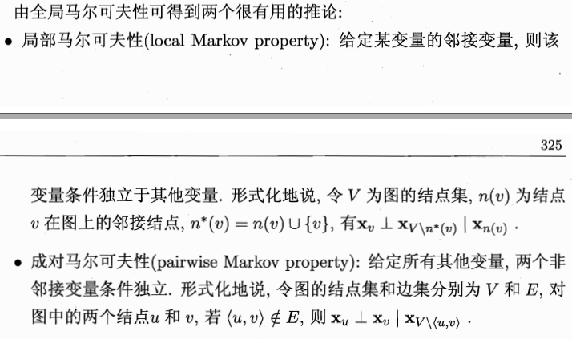
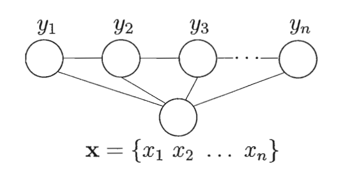

# 机器学习--概率图
---
## 预备知识
令状态变量集合为$Y$,可观测变量集合$O$,其它变量集合$R$,则有
- **生成式**：$P(Y,R,O)$
- **判别式**：$P(Y,R|O)$

给定一组观测变量值，推断就是要由$P(Y,R,O)$或$P(Y,R|O)$得到条件概率分布$P(Y|O)$.

> 生成模型是直接对联合分布进行建模，判别式模型是对条件分布进行建模。
## 概率图
概率图分为两种：
- 有向图（贝叶斯网）；
- 无向图（马尔科夫网）。

特殊的，HMM是结构最简单的动态贝叶斯网。
## 隐马尔科夫链(HMM)
令状态变量$y = \{y_1, y_2, \cdots, y_n\}^T$,观测变量$x = \{x_1, x_2, \cdots, x_n\}$。时刻$t_i$的状态变量(隐变量)$y_i \in \mathbb{Y} = \{s_1,s_2,\cdots, s_N\}$，观测变量$x_i \in \mathbb{X} = \{o_1,o_2,\cdots, o_M\}$。状态空间$\mathbb{Y}$为离散空间，$\mathbb{X}$可以是离散空间，也可以是连续空间。任意时刻$t$，$x_t$仅依赖于$y_t$，$y_t$仅依赖于$y_{t-1}$。满足这些要求的概率图称为**隐马尔可夫链**。

### 联合概率公式：
>$P(x_1,y_1,\cdots,x_n, y_n)=P(y_1)P(x_1|y_1)\prod_{i=2}^n{P(y_i|y_{i-1})P(x_i|y_i)}$

### HMM三组重要参数：
- **状态转移矩阵**：$A$，其中$a_{ij}=P(y_{t+1}=s_{t+1}|y_t=s_i)$;
- **输出观测矩阵**：$B$，其中$b_{ij}=P(x_t=o_j|y_t=s_i)$;
- **初始状态概率**：$\pi = (\pi_1,\pi_2,\cdots,\pi_N)$,$\pi_i=P(y_1=s_i)$.

### HMM三个基本问题：
- 已知$\lambda = [A,B,\pi]$，计算$P(x|\lambda)$;
- 已知$\lambda = [A,B,\pi]$和$x$，计算$y$;
- 已知$x$，$\argmax_{\lambda}P(x|\lambda)$.
## 马尔科夫随机场(MRF)

### 基本概念：
- **团**：$P$为图的节点子集，任意$p_i,p_j \in P, i \neq j$之间存在边连接；
- **极大团**：$P$为图的节点子集，任意$p_i \in P^{\mathcal{C}}$加入$P$后新的子集不构成团。
### 联合概率公式
令$x = \{x_1, x_2,\cdots, x_n\}$,$C$为所有团构成的集合且$Q_i \cap Q_j = \varnothing $，$Q \in C$对应的变量集合为$X_Q$,则联合概率$P(X)$定义为：

>$P(X)=\frac{1}{Z}\prod_{Q \in C}{\psi_Q(X_Q)}$

其中$\psi_Q(X_Q)$为势函数，$Z=\sum_X{\prod_{Q \in C}{\psi_Q(X_Q)}}$.
### 局部马尔科夫性

$X_A$,$X_B$在给定$X_C$的条件下独立，记作$X_A \perp X_B | X_C$.对应的联合概率：
>$P(X_A$,$X_B,X_C) = \frac{1}{Z}\psi_{AC}(X_A,X_C)\psi_{BC}(X_B,X_C)$

### 势函数
势函数用于刻画集合$Q$内元素间的相关性，取值一般为非负。为满足非负性一般使用指数形式：
>$\psi_Q(X_Q)=\exp^{-H_Q(X_Q)}$

$H_Q(X_Q)$是定义在$X_Q$上，一般表示为:
>$H_Q(X_Q)=\sum_{u,v \in Q,u\neq v}{\alpha_{uv}x_ux_v} + \sum_{v \in Q}{\beta_v x_v}$

## 条件随机场（CRF）
CRF是一种判别式无向图模型；
### 定义
无向图$G=<V,E>$,$y_v$为节点$v$的标记变量，$x_v$为$v$的观测变量，若任意$y_v$满足马尔科夫性：
>$P(y_v|x,y_{V \setminus \{v\}}) = P(y_v|x,y_{n(v)})$
### 链式条件随机场
标记序列建模一般使用链式条件随机场。

上图条件概率被定义为：
> $P(y|x)= \frac{1}{Z}\exp(\sum_j\sum_{i=1}^{n-1}\lambda_jt_j(y_{i+1}, y_i,x,i)+\sum_k\sum_{i=1}^n\mu_ks_k(y_i,x,i))$

其中$t_j(y_{i+1}, y_i,x,i)$是状态转移特征函数，$s_k(y_i,x,i)$是状态特征函数。

### 与马尔科夫场的区别
CRF处理的是条件概率，MRF处理的是联合概率。
## 学习推断
### 条件概率定义
设图模型所对应的变量集$X=\{x_1,x_2,\cdots,x_N\}$，$X =X_E \cup  X_F$，$X_E \perp  X_F$，条件概率定义如下:
> $P(X_F |  X_E) = \frac{P(X_F,  X_E)}{P(X_E)}= \frac{P(X_F,  X_E)}{\sum_{X_F}P(X_E，X_F)}$

边际分布计算公式如下：
>$P(X_E) = \sum_{X_F}P(X_E，X_F)$