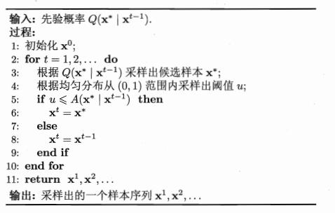

# 机器学习--概率图2
## MCMC
马尔科夫链蒙特卡罗是概率图模型中最常用的采样技术。令函数$f:X\mapsto R$, $x$的概率分布为$p(x)$，则函数的期望公式如下：
>$p(f)=\mathbb{E}_p[f(X)]=\int_x f(x)p(x)dx$

若$x$是高维变量且$p(x)$是一个很富在的分布，则上述期望计算将非常困难。

MCMC是通过构造平稳分布为$p$的马尔可夫链来并在其处于平稳状态时产生一批独立同分布且近似服从分布$p$的样本。
### 马尔科夫链平稳条件
令$T(\acute{x}|x)$为马尔科夫链T中状态$x$转移到$\acute{x}$的概率，$t$时刻的状态分布为$p(x^t)$，若时刻$t$有以下条件成立：
>$p(x^t)T(x^{t-1}|x^t)=p(x^{t-1})T(x^{t}|x^{t-1})$

则$p(x)$是$T$的平稳分布，且$T$在此时已收敛到平稳状态。
### Metropolis-Hastings（MH）算法
令状态$x^{t-1}$转移到$x^{*}$的概率为$Q(x^*|x^{t-1})A(x^*|x^{t-1})$,$Q(x^*|x^{t-1})$为先验概率，$A(x^*|x^{t-1})$为被接受概率。$x^*$处于平稳状态时有下式成立：
>$p(x^{t-1})Q(x^*|x^{t-1})A(x^*|x^{t-1}) =p(x^{*})Q(x^{t-1}|x^*)A(x^{t-1}|x^*)$

马氏平稳定理