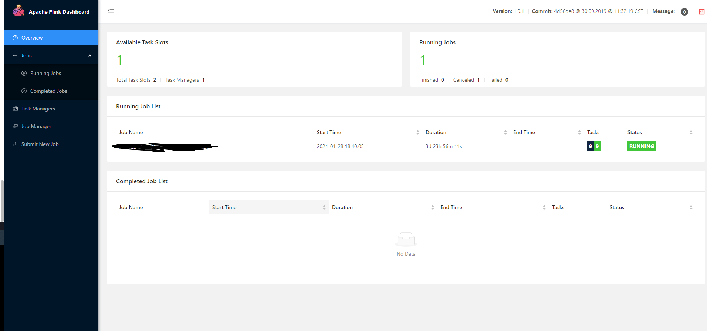

# 在虚机上部署flink集群
## 版本信息
- 系统： centos7 64
- jdk: 1.8.0_271，版本过低会造成无法运行
- scala: 2.11.12
- flink: flink-1.9.1-bin-scala_2.11
## 环境准备
### 默认jdk和scala配置
- 下载jdk和scala，解压到执行位置，将配置信息写入`/etc/profile`
```
#set java
export JAVA_HOME=/opt/jdk1.8.0_271
export CLASSPATH=.:$JAVA_HOME/lib/dt.jar:$JAVA_HOME/lib/tools.jar:$JAVA_HOME/jre/lib/rt.jar
export PATH=$PATH:$JAVA_HOME/bin

#set scala
SCALA_HOME=/usr/local/scala/scala-2.11.12
export PATH=$PATH:$SCALA_HOME/bin
```
- 将上述jdk配置为默认版本
```
update-alternatives --install /usr/bin/java java /opt/jdk1.8.0_271/bin/java 300
update-alternatives --install /usr/bin/javac javac /opt/jdk1.8.0_271/bin/javac 300
update-alternatives --install /usr/bin/jar jar /opt/jdk1.8.0_271/bin/jar 300
update-alternatives --install /usr/bin/javah javah /opt/jdk1.8.0_271/bin/javah 300
update-alternatives --install /usr/bin/javap javap /opt/jdk1.8.0_271/bin/javap 300
```
### 节点间ssh无密码登录
参考博客https://blog.csdn.net/developerof/article/details/89851621
### host修改
- 在所有虚机上执行`vim /etc/hosts`，将各节点ip及域名对应关系写入
```
127.0.0.1   localhost localhost.localdomain localhost4 localhost4.localdomain4
i::1         localhost localhost.localdomain localhost6 localhost6.localdomain6

192.61.2.10  taskmanager-01
192.61.2.120 jobmanager
```
- 重启虚机使hosts文件生效

## flink配置
### flink-conf.yaml配置
```
# jobmanager的域名
jobmanager.rpc.address: jobmanager

jobmanager.rpc.port: 6123

jobmanager.heap.size: 2048m

taskmanager.heap.size: 4096m
#   每个任务节点可以启多少个槽，一般设置为何cpu线程数一样
taskmanager.numberOfTaskSlots: 2

parallelism.default: 1

#   用于存储checkpoint快照
state.backend: filesystem
#   存储到虚机的文件系统中
state.checkpoints.dir: file:///opt/flink/checkpoints/

jobmanager.execution.failover-strategy: region
#   存储到虚机的文件系统中，已完成任务
jobmanager.archive.fs.dir: file:///opt/flink/completed-jobs/
#   历史记录服务
historyserver.web.address: 0.0.0.0
historyserver.web.port: 8082
historyserver.archive.fs.dir: file:///opt/flink/completed-jobs/
#   默认为/tmp目录，可能会造成集群无法停止
historyserver.web.tmpdir: file:///opt/flink/webtmpdir/
historyserver.archive.fs.refresh-interval: 10000
akka.ask.timeout: 120s
web.timeout: 120000
# 重启策略，按概率重启
restart-strategy: failure-rate
restart-strategy.failure-rate.max-failures-per-interval: 10
restart-strategy.failure-rate.failure-rate-interval: 300s
restart-strategy.failure-rate.delay: 15s
```
### log4j.properties日志配置
```
log4j.rootLogger=INFO, RFA

log4j.logger.akka=INFO
log4j.logger.org.apache.kafka=INFO
log4j.logger.org.apache.hadoop=INFO
log4j.logger.org.apache.zookeeper=INFO

log4j.appender.RFA=org.apache.log4j.RollingFileAppender
log4j.appender.RFA.File=${log.file}
log4j.appender.RFA.MaxFileSize=256MB
log4j.appender.RFA.Append=true
log4j.appender.RFA.MaxBackupIndex=10
log4j.appender.RFA.layout=org.apache.log4j.PatternLayout
log4j.appender.RFA.layout.ConversionPattern=%d{yyyy-MM-dd HH:mm:ss,SSS} %t %-5p %-60c %x - %m%n
 
log4j.logger.org.apache.flink.shaded.akka.org.jboss.netty.channel.DefaultChannelPipeline=ERROR, RFA
```
### master配置
```
jobmanager:8081
```
### slave配置
```
# 可以配置多个
taskmanager-01
```
## 启动flink集群
- 关闭所有虚机的防火墙：`systemctl stop firewalld`
- 将flink程序拷贝到所以虚机的相同位置，本博客所存放的位置为`/opt/flink/flink-1.9.1`
- 启动集群：`#/opt/flink/flink-1.9.1/bin/start-cluster.sh`
- 启动历史服务器：`#/opt/flink/flink-1.9.1/bin/historyserver.sh start`
- 查看已启动的服务：`#jps`:
```
[root@analysis bin]# jps
11318 HistoryServer
25446 Jps
10424 StandaloneSessionClusterEntrypoint

```
- 停止历史服务：`#/opt/flink/flink-1.9.1/bin/historyserver.sh stop`
- 停止集群：`#/opt/flink/flink-1.9.1/bin/stop-cluster.sh`

## 登录flink的webui页面
在浏览器中访问地址`http://jobmanager_ip:8081`
